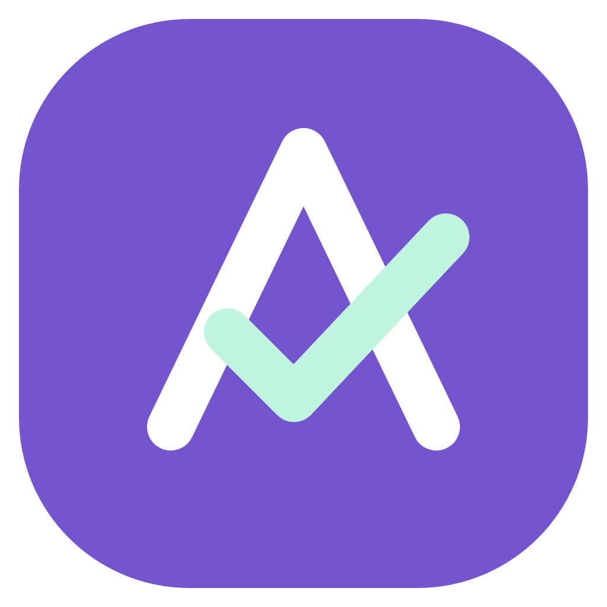
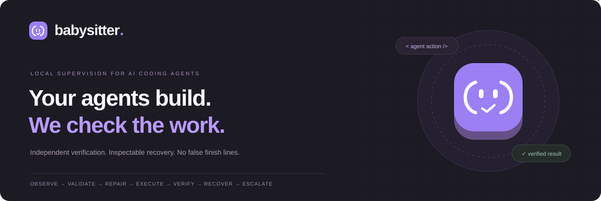
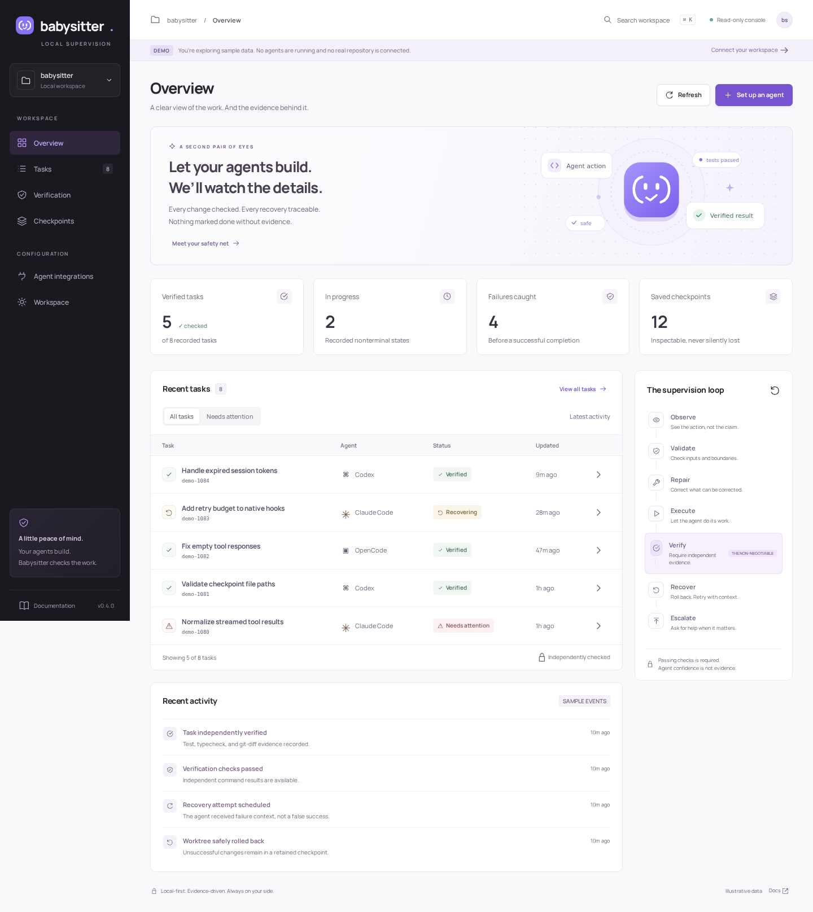
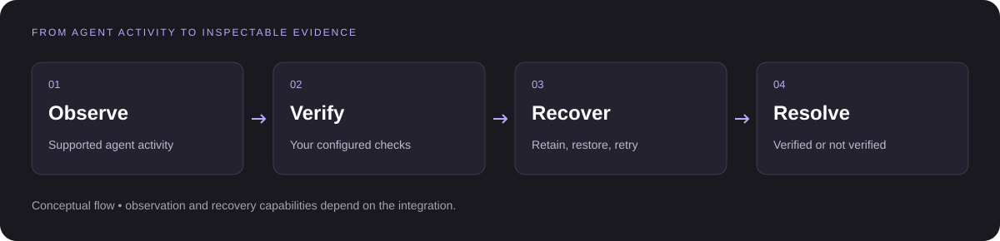

<p align="center">
  <a href="docs/BRAND.md">
    
  </a>
</p>

<h1 align="center">Aletheia</h1>

<p align="center"><strong>Local supervision. Visible evidence. Verified progress.</strong></p>

<p align="center">
  
</p>

<p align="center">
  <strong>The agent says “done.” Let the evidence speak.</strong><br>
  A local supervision runtime that checks AI-generated work, preserves failed changes,<br>
  and gives supported coding agents a bounded path to recovery.
</p>

<p align="center">
  <a href="LICENSE"></a>
  <a href="pyproject.toml"></a>
  <a href="CHANGELOG.md"></a>
  <a href="docs/CONSOLE.md"></a>
</p>

<p align="center">
  <a href="#quick-start">Quick start</a> ·
  <a href="#a-window-into-the-work">Console</a> ·
  <a href="#bring-your-agent">Integrations</a> ·
  <a href="#proof-without-the-hype">Validation</a> ·
  <a href="#go-deeper">Documentation</a>
</p>

---

## Fast is good. Verified is better.

An agent can write a convincing explanation of a change that still breaks your tests. It can repeat an unsuccessful edit. It can declare victory before the work is ready.

**Aletheia puts independent checks between a claim of completion and a verified result.** It works around supported agents and protocol workflows—not as another coding assistant, but as a supervision layer for the one you already use.

You define the checks. Your agent does the work. Aletheia records the evidence, retains unsuccessful changes within checkpoint scope, and manages bounded recovery when supported.

> **Confidence is a model output. Verification is a process.**

<table>
  <tr>
    <td width="50%"><strong>Check the work, not the wording.</strong><br>Run configured tests, type checks, and Git diff checks independently of the agent's completion claim.</td>
    <td width="50%"><strong>Keep failures inspectable.</strong><br>Retain unsuccessful file contents in content-addressed checkpoints before safe rollback.</td>
  </tr>
  <tr>
    <td><strong>Retry with a limit.</strong><br>Return actionable failure context within a bounded recovery budget, rather than looping indefinitely.</td>
    <td><strong>Read the evidence locally.</strong><br>Explore task histories, command output, and checkpoint previews in a separate read-only console.</td>
  </tr>
</table>

**Local-first supervision. No cloud account required for Aletheia. No credential scraping.** Your chosen agent or model provider may still require its own account and network access.

## A window into the work

<p align="center">
  
</p>

<p align="center"><sub>Actual console capture with synthetic demo data—not a real-model performance result. The capture predates the refreshed monogram.</sub></p>

One place to understand what happened—without giving the browser control over your agent.

| View | What you can inspect |
| :--- | :--- |
| **Overview** | Recorded task states, failed verification rounds, checkpoints, and recent activity |
| **Tasks** | Searchable histories, status filters, event timelines, and loaded-trace JSON export |
| **Verification** | Independent command output, exit codes, timing, and failures |
| **Checkpoints** | Retained manifests and file previews, without restoring files |
| **Integrations & workspace** | Setup instructions, capability boundaries, local configuration, and browser-only preferences |

```sh
aletheia ui          # Inspect the current repository
aletheia ui --demo   # Explore synthetic data without reading project state
```

Open **http://127.0.0.1:8040**. To inspect another repository, use `aletheia --root /path/to/project ui`.

The console does **not** launch agents, execute tests, grant permissions, restore files, or change task states. It can run beside a native agent without taking the supervisor lock. [Console guide →](docs/CONSOLE.md)

## Quick start

### 01 · Install the runtime

You need **Python 3.11+, Git, and Linux/macOS**. The repository you supervise must have at least one commit. Use a dedicated worktree and meaningful project-specific tests.

```sh
git clone https://github.com/ranaalyan1/aletheia.git
cd aletheia
python -m venv .venv
. .venv/bin/activate
pip install -e '.[dev]'
```

Already have this checkout? Start at `python -m venv .venv`. This installs Aletheia—not a model or coding agent. Install and authenticate your preferred agent through its official instructions. These instructions do not assume a published PyPI package.

### 02 · Define what “checked” means

With the virtual environment still active, move to the repository you want supervised:

```sh
cd /path/to/your/project

aletheia init \
  --test 'python -m pytest -q' \
  --typecheck 'python -m mypy src'

aletheia doctor --offline
```

Replace the sample checks with commands appropriate to **your project**, and ensure their tools are installed in the intended environment. Commands are argv arrays, not shell scripts; use absolute interpreter paths where needed.

`init` creates `aletheia.json`, excludes `.aletheia/` and `.env` from Git, and will not overwrite an existing configuration.

### 03 · Connect your agent

Choose **one** integration for the worktree.

**Claude Code · project-local hooks**

```sh
aletheia claude install
aletheia claude status
claude
```

Review the installed commands in `/hooks` before supervised work. [Claude Code setup →](docs/CLAUDE_CODE.md)

**Codex · project-local hooks with native trust**

```sh
aletheia codex install
aletheia codex status
codex
```

Trust the project and review/trust the exact installed definitions in `/hooks`. The installer does not bypass hook trust or change sandbox and permission settings. [Codex setup →](docs/CODEX.md)

**OpenCode · owned CLI wrapper**

```sh
aletheia opencode run 'Fix the failing tests'
```

Use this wrapper, not a normal OpenCode TUI session. Successful supervision requires **wrapper exit code 0 and `"verified": true`**. [OpenCode setup →](docs/OPENCODE.md)

### 04 · Inspect the outcome

```sh
aletheia ui
aletheia trace
aletheia trace TASK_ID
aletheia trace TASK_ID --metrics
aletheia trace TASK_ID --checkpoint CHECKPOINT_ID
```

Replace the uppercase placeholders with IDs from your recorded tasks and checkpoints.

## Bring your agent

**Different integrations have different contracts.** Compatibility is explicit, not a promise to observe everything an agent does.

| Integration | Observation boundary | Completion & recovery |
| :--- | :--- | :--- |
| **[Claude Code](docs/CLAUDE_CODE.md)** | Supported native command hooks | Stop checks, retained failures, bounded continuation |
| **[Codex](docs/CODEX.md)** | Supported hooks, Bash inputs, and patch paths | Stop checks; task, checkpoint, and budget persist through recovery |
| **[OpenCode](docs/OPENCODE.md)** | Emitted JSONL from an owned CLI process | Checks after clean process exit; same-session retry |
| **[Protocol runtime](docs/PROTOCOL.md)** | OpenAI-compatible / Anthropic-compatible protocol traffic and independent filesystem checks | Managed-tool or relay lifecycle; step-only escalation |

For protocol mode, configure an OpenAI-compatible upstream and run `aletheia start` (default port **8030**). The protocol API and browser console are separate services with separate trust boundaries. See the [protocol guide](docs/PROTOCOL.md) for headers, configuration, and managed/relay examples.

DeepSeek harness support and additional agents are **not implemented**. No adapter manages native provider credentials or silently switches a native agent's model.

## A failure should leave a trail—not a mystery.

<p align="center">
  
</p>

The full runtime lifecycle is **Observe → Validate → Repair → Execute → Verify → Recover → Escalate**. Each integration exposes a specific part of that contract.

1. **Establish a baseline.** Capture the starting worktree, including pre-existing uncommitted work within snapshot scope.
2. **Observe supported activity.** Record available evidence without inventing hidden plans or tool calls.
3. **Verify independently.** Run configured tests, type checks, and Git diff checks; check stable file fingerprints.
4. **Preserve the failure.** Retain unsuccessful contents in a content-addressed checkpoint before rollback.
5. **Recover within bounds.** Restore the baseline only when safe and return failure context for a correction.
6. **Report honestly.** Return an explicit not-verified outcome when evidence is insufficient or the retry budget is exhausted.

A restored baseline is **not** proof that a failed task was fixed. Missing checks, unfinished tools, stale verification, and uncertain process boundaries do not count as successful completion. Native recovery is capped at `min(max_attempts, 3)` Stop attempts / owned CLI invocations. A native escalation request is not an actual model switch.

## Proof without the hype

Official client integration tests have exercised **Claude Code 2.1.278**, **Codex 0.155.1**, and **OpenCode 1.18.31** against isolated, scripted local model endpoints.

These use real clients and native tools. They are **not real-model quality benchmarks**.

| Controlled upstream-repository test | Injected failure | Verified recovery |
| :--- | :--- | :--- |
| **Codex + ItsDangerous** | 40 failed / 257 passed | **297 passed** · mypy: 8 files · Git diff passed |
| **OpenCode + Click** | 15 failed / 2,044 passed | **2,059 passed** · mypy: 28 files · Git diff passed |

Click also reported 24 skipped, 31,000 deselected, and 1 xfailed; these are not counted as passes. Real weak/free model effectiveness, comparative superiority, and manual time savings remain **unmeasured**.

[Inspect versions, pinned revisions, reports, and reproduction steps →](docs/VALIDATION.md)

## Know the boundary

Aletheia is a supervision runtime, **not an OS sandbox or a guarantee of correctness**.

- **One supervisor per worktree.** Do not run competing native/protocol supervisors. The read-only console can coexist with one.
- **Observation is limited.** Hooks are not a complete action audit. OpenCode supervision is post-execution; its JSONL may omit internal activity.
- **Checkpoints have scope.** Ignored/generated files and external side effects are outside it. Detached/background agents and unsupported subagent workflows are not supported.
- **Checks are only as good as their coverage.** Passing configured checks does not prove every natural-language requirement or protect against malicious changes to the tests themselves.
- **Keep permissions and isolation.** Native permission controls, trusted configuration, and dedicated worktrees still matter.
- **Keep the console private.** It exposes source and evidence to authorized viewers. Non-loopback serving requires `ALETHEIA_UI_TOKEN`; the protocol API separately uses `ALETHEIA_LOCAL_TOKEN`. Never publish credentials or expose execution APIs.

[Security policy →](SECURITY.md)

## Built to be inspected. Open to contributions.

After installing the development dependencies, run these commands from the Aletheia checkout:

```sh
pytest -q
mypy aletheia
python scripts/demo.py --output .aletheia/demo-report.json
```

To include official native clients, supply their executable paths; otherwise those tests explicitly skip:

```sh
ALETHEIA_CLAUDE_BIN=/absolute/path/to/claude \
ALETHEIA_CODEX_BIN=/absolute/path/to/codex \
ALETHEIA_OPENCODE_BIN=/absolute/path/to/opencode pytest -q
```

Browser interaction and accessibility checks use a separate optional Node harness. **Using the console requires no Node runtime or frontend build.** See [Contributing](CONTRIBUTING.md) for the development workflow and browser-test instructions.

## Go deeper

| Start here | Explore the internals |
| :--- | :--- |
| [Getting started](docs/GETTING_STARTED.md) | [Architecture](docs/ARCHITECTURE.md) |
| [Console & security](docs/CONSOLE.md) | [Frozen task/event schema](docs/SCHEMA.md) |
| [Protocol integration](docs/PROTOCOL.md) | [Validation & reproduction](docs/VALIDATION.md) |
| [Contributing](CONTRIBUTING.md) | [Changelog](CHANGELOG.md) |

<details>
<summary><strong>Repository map</strong></summary>

```text
aletheia/
├── adapters/       Native hooks and owned OpenCode runner
├── console.py      Separate read-only console API
├── web/            Packaged UI, SVG assets, and local font
├── runtime.py      Supervision lifecycle
├── verify.py       Independent command evidence
├── project.py      Checkpoints and inspectable rollback
├── state.py        Task/event persistence
└── server.py       Protocol API
docs/               Setup, contracts, evidence, and brand assets
scripts/            Reproducible validation and asset-sync tools
tests/              Contract, regression, security, and browser checks
```

</details>

## The mark: an A that asks for evidence

<p align="center">
  
</p>

**Aletheia** takes its name from the Greek word for truth. The **evidence monogram** combines an open, architectural **A** with a rising verification check: a small visual reminder that a claim needs support. Violet connects it to the console; mint distinguishes the check from the letterform.

[SVG logo](docs/brand/logo.svg) · [PNG logo](docs/brand/logo.png) · [Monochrome](docs/brand/logo-monochrome.svg) · [Social card](docs/brand/social-card.png) · [Brand guide](docs/BRAND.md)

## License

Released under the [Apache License 2.0](LICENSE). The original logo and illustrations are included under the project license. The bundled Manrope font is distributed separately under the [SIL Open Font License](aletheia/web/assets/OFL-Manrope.txt).

---

<p align="center">
  <strong>Let agents move fast. Make “done” earn its meaning.</strong><br>
  <sub>Aletheia · Local supervision. Inspectable evidence. Bounded recovery.</sub>
</p>
